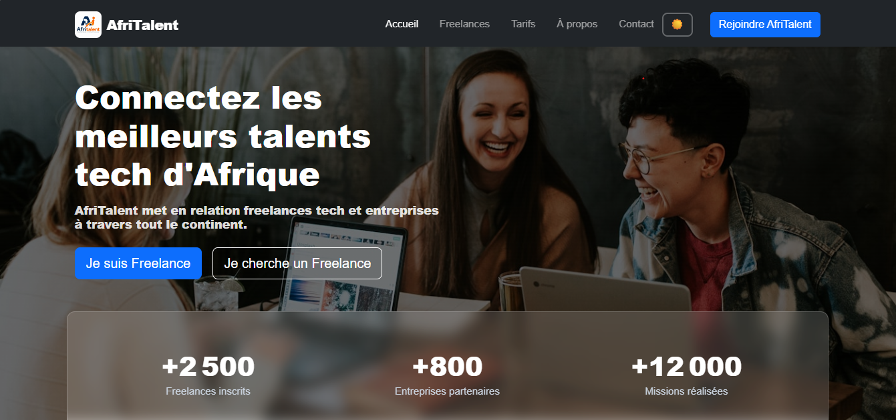

# AfriTalent 🌍

Projet fil rouge — Plateforme de mise en relation entre freelances africains et
clients.
Auteur : Papa Djiby Ndiaye
Promotion : L1 Web — ISI

---

## Description 📜

AfriTalent est un site vitrine complet d'une plateforme fictive de mide en relation entre
freelance tech et entreprise en Afrique. Le site presente les fonctionnalités, Les tarifs et des
freelance disponible a travers tout le continent Africain.

---

## Structure du projet 📁

```
Ndiaye-PapaDjiby-AfriTalent/
├── index.html → Page d'accueil
├── freelances.html → Catalogue de freelances
├── tarifs.html → Plans et tarification
├── about.html → À propos
├── contact.html → Contact
├── css/
│ └── style.css → Feuille de style principale
├── Js/
│ └── main.js → Script JavaScript principal
├── images/ → Images et logos
├── docs/
│ └── Ndiaye_PapaDjiby_Presentation.pptx
├── README.md
└── .gitignore
```

---

## Ressources consultées 📚

| Ressource       | URL                                |
| --------------- | ---------------------------------- |
| MDN Web Docs    | https://developer.mozilla.org/fr/  |
| Bootstrap 5     | https://getbootstrap.com/docs/5.3/ |
| Google Fonts    | https://fonts.google.com/          |
| Bootstrap Icons | https://icons.getbootstrap.com/    |
| CSS-Tricks      | https://css-tricks.com/            |
| W3C Validator   | https://validator.w3.org/          |
| Unsplash        | https://unsplash.com/              |
| Coolors         | https://coolors.co/                |

---

## Captures d'écran 🖥️



---

## lien GitHub Pages 🪢

[voir le site en ligne](https://papadjibyndiaye3-crypto.github.io/Ndiaye-PapaDjiby-AfriTalent/)
